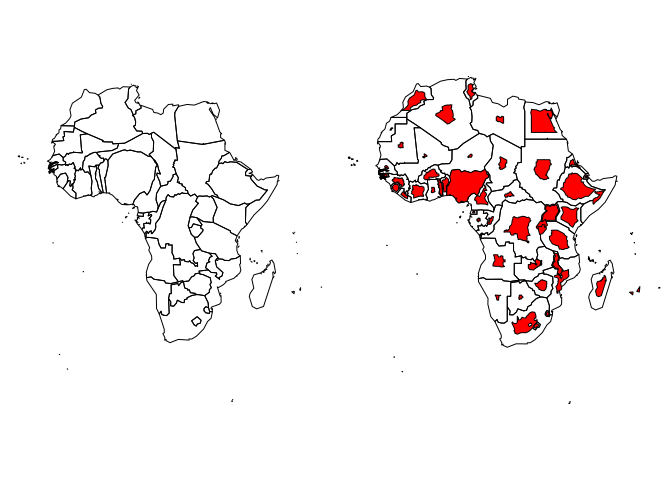

cartogram: Create Cartograms with R
================

[](https://travis-ci.org/sjewo/cartogram)
[](https://cran.r-project.org/package=cartogram)

Construct a continuous area cartogram by a rubber sheet distortion
algorithm (Dougenik et al. 1985) or non-contiguous Area Cartograms
(Olson 1976) in R.

## Installation

You can install the **cartogram** package from CRAN as follows:

``` r
install.packages("cartogram")
```

To upgrade to the latest development version of `cartogram`, install the
package `devtools` and run the following command:

``` r
devtools::install_github("sjewo/cartogram")
```

## NEWS

  - \[0.1.0\] Non-Overlapping Circles Cartogram (sf and sp)
  - \[0.0.3\] sf support added
  - \[0.0.2\] Non-contiguous Area Cartogram
  - \[0.0.2\] Prepare data with missing or extreme values before
    cartogram calculation for faster convergence
  - \[0.0.1\] Initial Release

## Examples

### Continuous Area Cartogram

``` r
library(cartogram)
library(tmap)
library(maptools)
#> Loading required package: sp
#> Checking rgeos availability: TRUE

data(wrld_simpl)

afr <- wrld_simpl[wrld_simpl$REGION==2,]
afr <- spTransform(afr, CRS("+init=epsg:3395"))

# construct cartogram
afrc <- cartogram_cont(afr, "POP2005", itermax=5)
#> Mean size error for iteration 1: 5.79457153280442
#> Mean size error for iteration 2: 4.99349670513046
#> Mean size error for iteration 3: 4.39148731971216
#> Mean size error for iteration 4: 3.92873533652118
#> Mean size error for iteration 5: 3.56785782735669

# plot it
tm_shape(afrc) + tm_fill("POP2005", style="jenks") + 
  tm_borders() + tm_layout(frame=F)
```

<!-- -->

### Non-contiguous Area Cartogram

Many thanks to @rCarto and @neocarto for contributing the code\!

``` r
library(cartogram)
library(tmap)
library(maptools)

data(wrld_simpl)

afr <- wrld_simpl[wrld_simpl$REGION==2,]
afr <- spTransform(afr, CRS("+init=epsg:3395"))

# construct cartogram
afrnc <- cartogram_ncont(afr, "POP2005")

# plot it
tm_shape(afr) + tm_borders() + 
  tm_shape(afrnc) + tm_fill("POP2005", style="jenks") + 
  tm_borders() + tm_layout(frame=F)
```

<!-- -->

### Non-Overlapping Circles Cartogram

Many thanks to @rCarto for contributing the code\!

``` r
library(cartogram)
library(tmap)
library(maptools)

data(wrld_simpl)

afr <- wrld_simpl[wrld_simpl$REGION==2,]
afr <- spTransform(afr, CRS("+init=epsg:3395"))

# construct cartogram
afrnoc <- cartogram_noc(afr, "POP2005")

# plot it
tm_shape(afr) + tm_borders() + 
  tm_shape(afrnoc) + tm_fill("POP2005", style="jenks") + 
  tm_borders() + tm_layout(frame=F)
```

<!-- -->

## sf support

Thanks to @Nowosad for speeding things up\!

``` r
library(sf)
#> Linking to GEOS 3.6.2, GDAL 2.3.0, proj.4 5.0.1
library(cartogram)
library(maptools)

data(wrld_simpl)

afr <- wrld_simpl[wrld_simpl$REGION==2,]
afr <- spTransform(afr, CRS("+init=epsg:3395"))

afr_sf = st_as_sf(afr)

# Display plots in two columns
par(mfrow=c(1,2), mai=c(0,0,0,0))

# Continuous Area Cartogram
afr_sf_carto <- cartogram_cont(afr_sf, "POP2005", 3)
#> Mean size error for iteration 1: 5.79457153280442
#> Mean size error for iteration 2: 4.94825547349441
#> Mean size error for iteration 3: 4.32626995057148
plot(st_geometry(afr_sf_carto))

# Plot Non-contiguous Area Cartogram
afr_sf_nc <- cartogram_ncont(afr_sf, "POP2005")
plot(st_geometry(afr_sf))
plot(st_geometry(afr_sf_nc), add = TRUE, col = 'red')
```

<!-- -->

## References

  - Dorling, D. (1996). Area Cartograms: Their Use and Creation. In
    Concepts and Techniques in Modern Geography (CATMOG), 59.
  - Dougenik, J. A., Chrisman, N. R., & Niemeyer, D. R. (1985). An
    Algorithm To Construct Continuous Area Cartograms. In The
    Professional Geographer, 37(1), 75-81.
  - Olson, J. M. (1976), Noncontiguous Area Cartograms. The Professional
    Geographer, 28: 371–380. <doi:10.1111/j.0033-0124.1976.00371.x>
